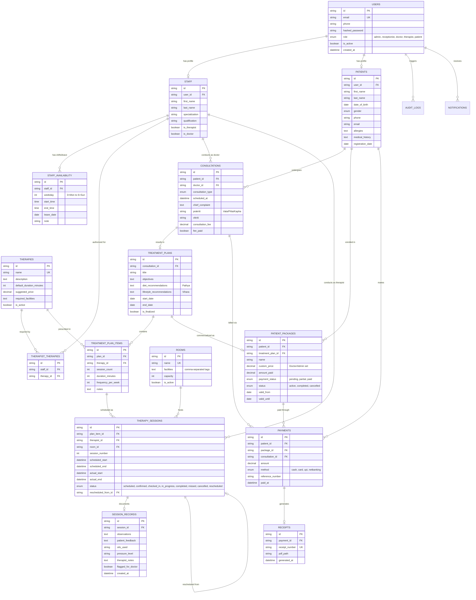

# AyurSutra — Entity-Relationship (ER) Diagram

```mermaid
erDiagram
    USERS ||--o| STAFF : "has profile"
    USERS ||--o| PATIENTS : "has profile"
    USERS ||--o{ AUDIT_LOGS : "triggers"
    USERS ||--o{ NOTIFICATIONS : "receives"

    STAFF ||--o{ STAFF_AVAILABILITY : "has shifts/leave"
    STAFF ||--o{ THERAPIST_THERAPIES : "authorized for"
    STAFF ||--o{ CONSULTATIONS : "conducts as doctor"
    STAFF ||--o{ THERAPY_SESSIONS : "conducts as therapist"

    THERAPIES ||--o{ THERAPIST_THERAPIES : "required by"
    THERAPIES ||--o{ TREATMENT_PLAN_ITEMS : "prescribed in"

    ROOMS ||--o{ THERAPY_SESSIONS : "hosts"

    PATIENTS ||--o{ CONSULTATIONS : "undergoes"
    PATIENTS ||--o{ PATIENT_PACKAGES : "enrolled in"
    PATIENTS ||--o{ PAYMENTS : "makes"

    CONSULTATIONS ||--o| TREATMENT_PLANS : "results in"
    CONSULTATIONS ||--o{ PAYMENTS : "billed via"

    TREATMENT_PLANS ||--o{ TREATMENT_PLAN_ITEMS : "contains"
    TREATMENT_PLANS ||--o| PATIENT_PACKAGES : "commercialized as"

    TREATMENT_PLAN_ITEMS ||--o{ THERAPY_SESSIONS : "scheduled as"

    PATIENT_PACKAGES ||--o{ PAYMENTS : "paid through"

    PAYMENTS ||--o| RECEIPTS : "generates"

    THERAPY_SESSIONS ||--o| SESSION_RECORDS : "documents"
    THERAPY_SESSIONS ||--o| THERAPY_SESSIONS : "rescheduled from"

    USERS {
        string id PK
        string email UK
        string phone
        string hashed_password
        enum role "admin, receptionist, doctor, therapist, patient"
        boolean is_active
        datetime created_at
    }

    STAFF {
        string id PK
        string user_id FK
        string first_name
        string last_name
        string specialization
        string qualification
        boolean is_therapist
        boolean is_doctor
    }

    STAFF_AVAILABILITY {
        string id PK
        string staff_id FK
        int weekday "0=Mon to 6=Sun"
        time start_time
        time end_time
        date leave_date
        string note
    }

    ROOMS {
        string id PK
        string name UK
        text facilities "comma-separated tags"
        int capacity
        boolean is_active
    }

    THERAPIES {
        string id PK
        string name UK
        text description
        int default_duration_minutes
        decimal suggested_price
        text required_facilities
        boolean is_active
    }

    THERAPIST_THERAPIES {
        string id PK
        string staff_id FK
        string therapy_id FK
    }

    PATIENTS {
        string id PK
        string user_id FK
        string first_name
        string last_name
        date date_of_birth
        enum gender
        string phone
        string email
        text allergies
        text medical_history
        date registration_date
    }

    CONSULTATIONS {
        string id PK
        string patient_id FK
        string doctor_id FK
        enum consultation_type
        datetime scheduled_at
        text chief_complaint
        string prakriti "Vata/Pitta/Kapha"
        string vikriti
        decimal consultation_fee
        boolean fee_paid
    }

    TREATMENT_PLANS {
        string id PK
        string consultation_id FK
        string title
        text objectives
        text diet_recommendations "Pathya"
        text lifestyle_recommendations "Vihara"
        date start_date
        date end_date
        boolean is_finalized
    }

    TREATMENT_PLAN_ITEMS {
        string id PK
        string plan_id FK
        string therapy_id FK
        int session_count
        int duration_minutes
        int frequency_per_week
        text notes
    }

    PATIENT_PACKAGES {
        string id PK
        string patient_id FK
        string treatment_plan_id FK
        string name
        decimal custom_price "Doctor/Admin set"
        decimal amount_paid
        enum payment_status "pending, partial, paid"
        enum status "active, completed, cancelled"
        date valid_from
        date valid_until
    }

    PAYMENTS {
        string id PK
        string patient_id FK
        string package_id FK
        string consultation_id FK
        decimal amount
        enum method "cash, card, upi, netbanking"
        string reference_number
        datetime paid_at
    }

    RECEIPTS {
        string id PK
        string payment_id FK
        string receipt_number UK
        string pdf_path
        datetime generated_at
    }

    THERAPY_SESSIONS {
        string id PK
        string plan_item_id FK
        string therapist_id FK
        string room_id FK
        int session_number
        datetime scheduled_start
        datetime scheduled_end
        datetime actual_start
        datetime actual_end
        enum status "scheduled, confirmed, checked_in, in_progress, completed, missed, cancelled, rescheduled"
        string rescheduled_from_id FK
    }

    SESSION_RECORDS {
        string id PK
        string session_id FK
        text observations
        text patient_feedback
        string oils_used
        string pressure_level
        text therapist_notes
        boolean flagged_for_doctor
        datetime created_at
    }
```
